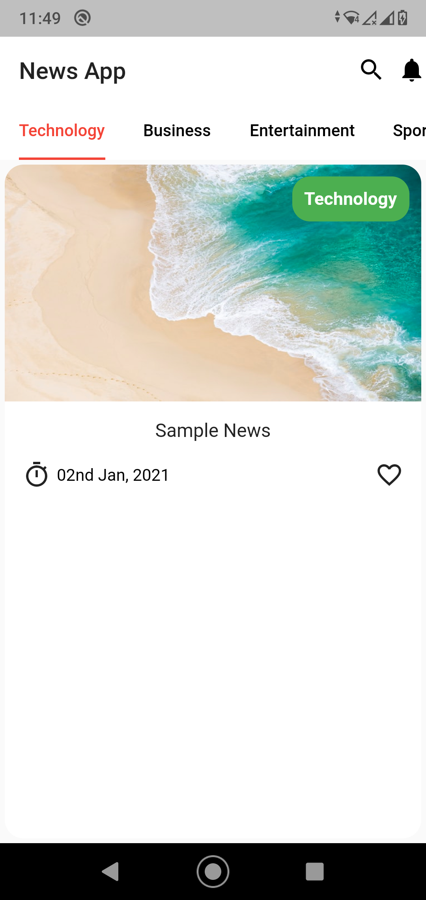
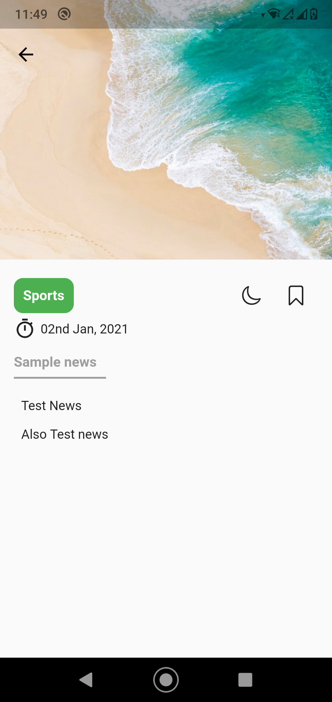
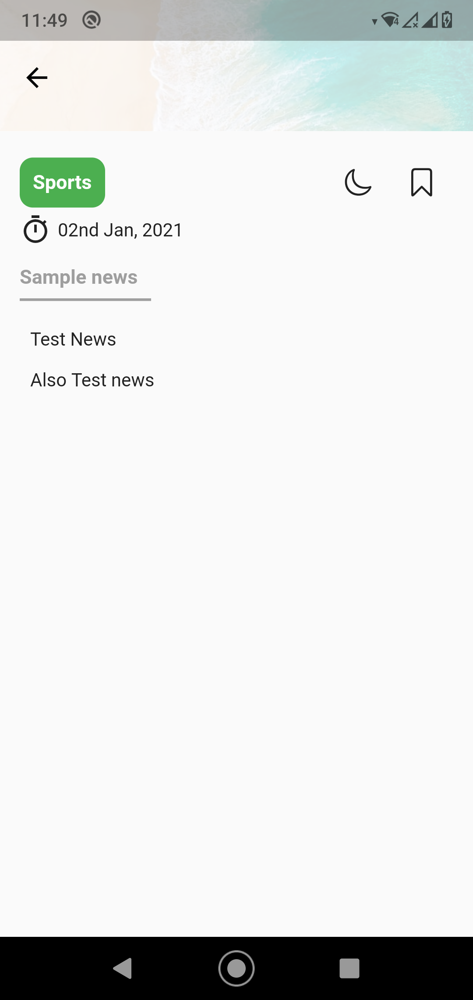

This is the first page where user will see the newses catagory wise :

After clicking any news card user will see the news description page :

Image of this description page is in a expandable appbar, so it will collaps when user will scroll down to see the details :

